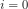

# Variable Sized Arrays
## Objective

Consider an -element array, , where each index 
 in the array contains a reference to an array of  
integers (where the value of  varies from array to array). See the 
_Explanation_ section below for a diagram.

Given , you must answer  queries. Each query is in 
the format `i j`, where  denotes an index in array  
and  denotes an index in the array located at . 
For each query, find and print the value of element  in the array at 
location  on a new line.

Click [here](http://www.cplusplus.com/reference/vector/vector/) to know more about how to create 
variable sized arrays in C++.

**Input Format**

The first line contains two space-separated integers denoting the respective values 
of  (the number of variable-length arrays) and  
(the number of queries).
Each line  of the  subsequent lines contains a 
space-separated sequence in the format  
describing the -element array located at .
Each of the  subsequent lines contains two space-separated integers 
describing the respective values of  (an index in array ) 
and  (an index in the array referenced by ) for a query.

**Constraints**

* 
* 
* 
* 
* 
* 
* All indices in this challenge are zero-based.
* All the given numbers are non negative and are not greater than 

**Output Format**

For each pair of  and  values (i.e., for each query), 
print a single integer denoting the element located at index  of the array 
referenced by . There should be a total of  lines of output.

**Sample Input**

```bash
2 2
3 1 5 4
5 1 2 8 9 3
0 1
1 3
```

**Sample Output**

```bash
5
9
```

**Explanation**

The diagram below depicts our assembled Sample Input:


We perform the following  queries:

1. Find the array located at index , which corresponds to 
. We must print the value at index  
of this array which, as you can see, is .
2. Find the array located at index , which corresponds to 
. We must print the value at index  
of this array which, as you can see, is .
